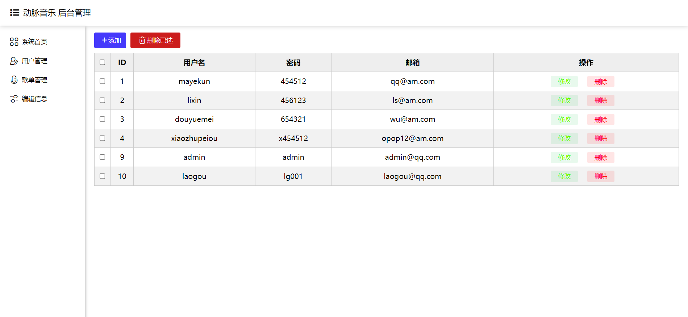

<h1 align="center" style="margin: 30px 0 30px; font-weight: bold;">ArteryMusic v1.1</h1>
<h4 align="center">基于JavaWeb的在线音乐系统（动脉音乐网站)</h4>
<p align="center">
   <a href="https://gitee.com/mayestspace/openfeet/stargazers">
      
   </a>
	<a href="https://gitee.com/mayestspace/artery-music">
      
   </a>
	<a href="https://gitee.com/mayestspace/artery-music/blob/master/LICENSE">
      
   </a>
</p>

#### 介绍

一个简单的在线音乐系统（动脉音乐网站）

#### 软件架构
`Java+Javaweb+Servlet+Jsp+mybatis+mysql+Tomcat`

***需要引入的jar包***
>可去`Maven Repository`官网下载：[https://mvnrepository.com/](https://mvnrepository.com/)
```java
commons-dbutils-1.7.jar
javax.servlet-api-4.0.1.jar
jstl-1.2.jar
mybatis-3.5.11.jar
mysql-connection-j-8.0.32.jar
```


#### 安装教程

1.  执行SQL，创建数据库
```md
(SQL文件位于：https://gitee.com/mayestspace/artery-music/blob/master/src/arterymusic.spl)
```
2.  项目导入IDEA 启动
3.  访问测试！
4.  自行根据代码逻辑填充测试数据，查看即可！

#### 演示界面

- 首页


- 登录


- 注册


- 数字商店（音乐会员购买）


- 管理员操作界面



