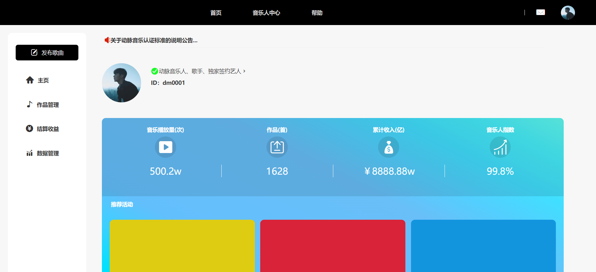

<p align="center">
    
</p>
<h1 align="center" style="font-weight: bold;">ArteryMusic</h1>
<h4 align="center">基于JavaWeb的在线音乐系统（动脉音乐网站)</h4>
<p align="center">
   <a href="https://gitee.com/mayestspace/openfeet/stargazers">
      
   </a>
	<a href="https://gitee.com/mayestspace/artery-music">
      
   </a>
	<a href="https://gitee.com/mayestspace/artery-music/blob/master/LICENSE">
      
   </a>
</p>

### 🔖关于动脉音乐

ArteryMusic是一个简单的在线音乐系统（动脉音乐网站），支持用户登录、用户注册、信息管理（增删改查）、音频播放以及数字购买商店等，集成最新的`mysql`数据库和`mybatis`框架；极大的提升该项目的使用体验与后续二次开发。

**重点：** 持续开发中......

### 🎃软件架构

#### 1）技术栈

|                 后端                 |          前端           |
| :----------------------------------: | :---------------------: |
| Javaweb+Servlet+mybatis+MySQL+Tomcat | HTML+JSP+CSS+JavaScript |

`Java+Javaweb+Servlet+Jsp+mybatis+mysql+Tomcat`

#### 2）需要引入的 jar 包（重点）

>可去`Maven Repository`官网下载：[https://mvnrepository.com/](https://mvnrepository.com/)
```java
commons-dbutils-1.7.jar
javax.servlet-api-4.0.1.jar
jstl-1.2.jar
mybatis-3.5.11.jar
mysql-connection-j-8.0.32.jar
```

#### 3）项目结构


### 💻安装部署

1.  执行SQL，创建数据库
```md
(SQL文件位于：https://gitee.com/mayestspace/artery-music/blob/master/src/arterymusic.spl)
```
2.  项目导入IDEA 启动
3.  访问测试！
4.  自行根据代码逻辑填充测试数据，查看即可！

### 🌎️在线体验

【免注册登录体验】：[http://music.rezone.top/](http://music.rezone.top/)

【后台管理入口】：[http://localhost:8080/ArteryMusic/adminIndex.jsp](http://localhost:8080/ArteryMusic/adminIndex.jsp)

```java
Tips 本地部署时换成实际本地端口进行访问。
例：http://本地端口/ArteryMusic/后台管理页面（默认是adminIndex.jsp）
```


### 📺演示界面
|  |  |
| -------------------------------- | -------------------------------------------- |
|         |         |
|  |                 |


### 📑许可证书

本项目基于[GPL-3.0](https://gitee.com/mayestspace/artery-music/blob/master/LICENSE)协议许可，特此声明可用于个人课程设计与学习使用。

